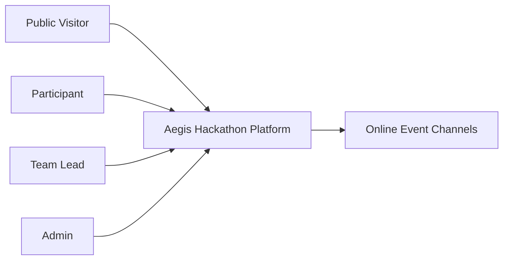
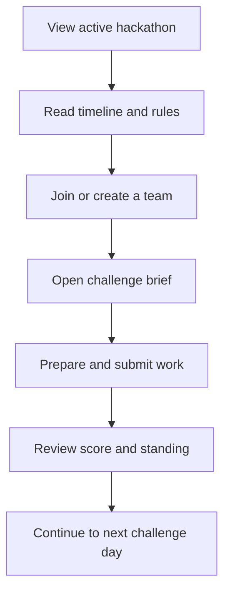
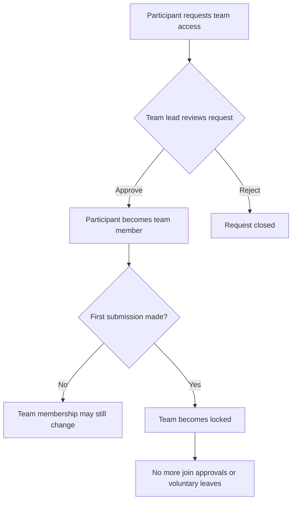
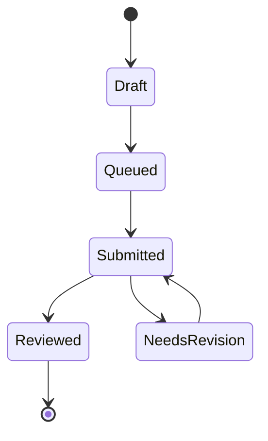

# Software Requirements Specification

## 1. Introduction

### 1.1 Purpose

This Software Requirements Specification (SRS) defines the functional and non-functional requirements for the Aegis Hackathon Platform. It serves as the authoritative reference for what the system shall do, how users interact with it, and what constraints govern its behavior.

This document is intended for developers, testers, and stakeholders involved in the development and evaluation of the platform.

### 1.2 Scope

The Aegis Hackathon Platform is a web-based system for organizing and participating in online hackathons. The platform supports the complete event lifecycle: event configuration, challenge delivery, team formation, project submission, scoring, and progress tracking.

The system shall:

- Present the active hackathon and its associated content to participants
- Support authenticated access with role-based authorization
- Enable team formation through a request-and-approval workflow
- Accept, review, and score challenge submissions
- Provide real-time leaderboard and progress tracking
- Maintain usability during intermittent connectivity

### 1.3 Definitions

| Term | Definition |
|------|-----------|
| Hackathon | A time-bound event consisting of daily challenges, rules, and a schedule |
| Challenge | A scored task assigned to a specific day within a hackathon |
| Submission | A participant's deliverable for a challenge, subject to review and scoring |
| Skill track | An optional learning module available alongside challenges |
| Team lock | The state where a team's roster becomes immutable after its first submission |

### 1.4 Document Conventions

Requirements are labeled with a prefix indicating their category: FR (functional), NFR (non-functional), BR (business rule).

---

## 2. Overall Description

### 2.1 Product Perspective

The platform is a self-contained web application. It does not depend on external event management systems or physical venue infrastructure. All event delivery is online-first, referencing streams, chat channels, and digital portals.

### 2.2 User Classes

| User Class | Description |
|-----------|-------------|
| **Public visitor** | Unauthenticated user who can view public event information and leaderboards |
| **Participant** | Authenticated user who can browse event content, form teams, submit work, and track progress |
| **Team lead** | A participant with authority to approve or reject join requests for their team |
| **Admin** | Privileged user who configures events, manages content, and reviews submissions |

### 2.3 Operating Environment

The platform operates as a progressive web application accessible through modern web browsers. The server component requires a Node.js runtime and a PostgreSQL database. The system shall function across desktop and mobile form factors.

### 2.4 Constraints

- Only one hackathon may be active and participant-facing at any given time
- The platform does not assume physical venue availability
- Offline capabilities are limited to previously loaded content and queued submissions

---

## 3. System Diagrams

### 3.1 Context Diagram

### 3.2 Participant Experience Flow

### 3.3 Team Access Control

### 3.4 Submission Lifecycle

---

## 4. Functional Requirements

### 4.1 Public Access

- **FR-1:** The system shall display a public overview of the active hackathon.
- **FR-2:** The system shall provide a public leaderboard.
- **FR-3:** The system shall provide entry points for user authentication.

### 4.2 Authentication and Authorization

- **FR-4:** The system shall require authentication for participant and admin areas.
- **FR-5:** The system shall automatically provision a participant record upon first authenticated access.
- **FR-6:** The system shall restrict administrative functions to users with the admin role.

### 4.3 Event Presentation

- **FR-7:** The system shall display the active hackathon's name, description, dates, and current phase (upcoming, live, completed).
- **FR-8:** The system shall display published challenge days with title, summary, difficulty, point value, unlock time, and submission deadline.
- **FR-9:** The system shall display scheduled events with time, title, venue reference, and day number.
- **FR-10:** The system shall display published rules and skill tracks for the active hackathon.

### 4.4 Team Management

- **FR-11:** The system shall allow participants to create a team within the active hackathon.
- **FR-12:** The system shall allow participants to request access to an existing team.
- **FR-13:** The system shall allow team leads to approve or reject pending join requests.
- **FR-14:** The system shall enforce a maximum team size as configured by the hackathon.
- **FR-15:** The system shall lock team membership after the team's first submission is recorded.
- **FR-16:** The system shall prevent a participant from belonging to more than one team per hackathon.

### 4.5 Submissions

- **FR-17:** The system shall allow participants to submit work against published challenges.
- **FR-18:** The system shall reject submissions for challenges that have not yet unlocked.
- **FR-19:** The system shall apply the hackathon's late-submission policy after a challenge's deadline.
- **FR-20:** The system shall associate submissions with the participant's current team membership.
- **FR-21:** The system shall allow participants to view their own submission history and details.

### 4.6 Review and Scoring

- **FR-22:** The system shall allow admins to review submitted work.
- **FR-23:** The system shall allow admins to assign a raw score to a submission.
- **FR-24:** The system shall calculate the final score by applying any applicable late penalty.
- **FR-25:** The system shall use final scores in leaderboard rankings and participant totals.

### 4.7 Administration

- **FR-26:** The system shall allow admins to create, update, and activate hackathons.
- **FR-27:** The system shall allow admins to manage challenges, schedule events, rules, and skill tracks.
- **FR-28:** The system shall allow admins to configure team size limits and late-submission policies per hackathon.
- **FR-29:** The system shall provide an admin dashboard with event and participant progress summaries.

### 4.8 Offline Continuity

- **FR-30:** The system shall preserve access to previously loaded content during temporary connectivity loss.
- **FR-31:** The system shall queue submission actions locally and synchronize them when connectivity is restored.

### 4.9 Empty States

- **FR-32:** The system shall display contextual guidance when a view has no relevant data, directing the user toward the next valid action.

---

## 5. Information Model

### 5.1 Hackathon

Name, description, start date, end date, active status, team size limits, late-submission policy.

### 5.2 Challenge

Day number, title, summary, description, setup instructions, resources, point value, unlock time, submission deadline.

### 5.3 Schedule Event

Day number, time, title, venue/channel reference, display order.

### 5.4 Team

Name, creator, member list, member roles, lock status.

### 5.5 Submission

Participant, team association, challenge association, project title, description, category, review status, raw score, final score.

### 5.6 Skill Track

Module identifier, title, description, participant completion status.

---

## 6. Business Rules

- **BR-1:** Only one hackathon shall be participant-facing at a time.
- **BR-2:** Team names shall be unique within the same hackathon.
- **BR-3:** A participant shall belong to at most one team per hackathon.
- **BR-4:** Joining an existing team requires approval from the team lead.
- **BR-5:** Team membership locks after the team's first submission.
- **BR-6:** Challenge availability follows published unlock times.
- **BR-7:** Post-deadline submission handling follows the hackathon's configured late policy.

---

## 7. Non-Functional Requirements

### 7.1 Availability

- **NFR-1:** The system shall remain usable for core participant workflows during intermittent connectivity.
- **NFR-2:** Previously loaded content shall remain accessible during temporary network loss.

### 7.2 Usability

- **NFR-3:** The current event state, next milestone, and recommended next action shall be clearly presented to participants.
- **NFR-4:** Time-sensitive information (unlock times, deadlines) shall be prominent in participant views.
- **NFR-5:** All administrative tasks shall be performable through the web interface without direct database access.

### 7.3 Security

- **NFR-6:** Protected areas shall require token-based authentication.
- **NFR-7:** Administrative functions shall require explicit admin authorization.
- **NFR-8:** Participants shall not be able to access other participants' private submission data.
- **NFR-9:** Participants shall not be able to submit on behalf of a team they do not belong to.

### 7.4 Reliability

- **NFR-10:** Submission actions shall not be silently lost during connectivity interruptions.
- **NFR-11:** Scoring outcomes shall be consistent across participant and admin views.

### 7.5 Portability

- **NFR-12:** The system shall be deployable as a Docker container to any container hosting platform.
- **NFR-13:** The system shall function across modern desktop and mobile browsers.

---

## 8. Hosting

| Service | Purpose | Tier |
|---------|---------|------|
| **Render** | Application hosting (Docker) | Free |
| **Neon** | PostgreSQL database and authentication | Free |

The repository includes a `render.yaml` blueprint for automated deployment. The Dockerfile produces a production image that serves both the API and static frontend on a single port.

### Environment Variables

| Variable | Description |
|----------|-------------|
| `DATABASE_URL` | PostgreSQL connection string |
| `NEON_AUTH_URL` | Authentication endpoint URL |
| `CORS_ORIGIN` | Allowed origin(s) for cross-origin requests |
| `NODE_ENV` | Runtime environment identifier |
| `PORT` | Server listening port |

---

## 9. Known Limitations

- Binary media upload is not yet supported in the submission workflow.
- Offline continuity covers navigation and queued submissions, not a full local replica of all event data.

---

## 10. Document Maintenance

This SRS shall be revised whenever the platform changes in a way that materially affects event structure, participant workflows, team rules, challenge timing, scoring policy, administrative controls, or offline behavior.
