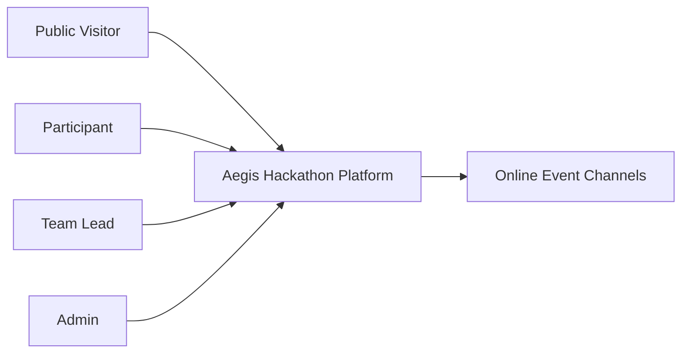
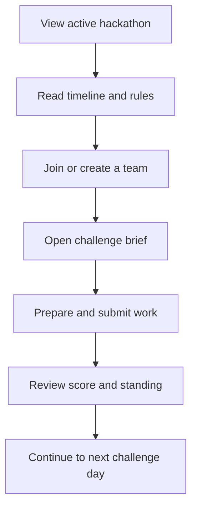
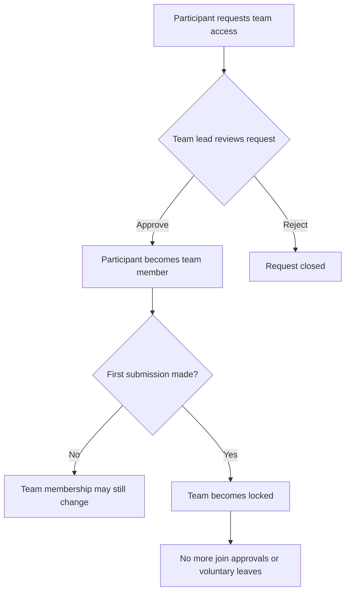
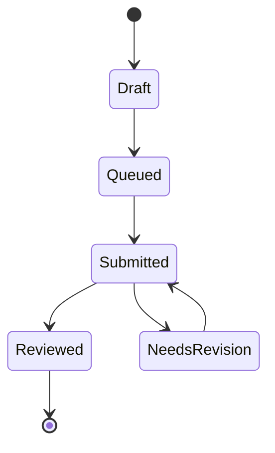

# Software Requirements Specification

## 1. Document Control

### 1.1 System Name

Aegis Hackathon Platform

### 1.2 Document Status

Current approved requirements baseline

### 1.3 Last Updated

March 29, 2026

### 1.4 Purpose

This Software Requirements Specification defines what the Aegis Hackathon Platform shall do for public visitors, participants, team leads, judges, and organizers.

This document describes the product behavior and operating rules of the platform. It is not intended to describe source code structure or internal implementation details.

## 2. Scope

The platform supports the planning and delivery of online hackathons. It presents the active event, challenge calendar, rules, team workflow, submissions, scoring, participant progress, and organizer controls in a single product.

The platform shall support:

- publication of the current or next active hackathon
- online-first challenge delivery and event scheduling
- participant sign-in and protected event access
- request-based team membership
- challenge submission and review
- organizer management of hackathons, challenges, schedule items, rules, and skill tracks
- continuity during unstable connectivity

The platform shall not depend on physical venues or in-person event assumptions.

## 3. Product Overview

The platform is an online hackathon workspace. It gives participants one place to understand what event is active, what is happening now, which challenge day is open, what deadlines are approaching, how teams are managed, and how progress is being measured.

The homepage for signed-in participants shall surface the active or upcoming hackathon, the event phase, the next published online sessions, challenge availability, and personal progress indicators.

The platform shall treat one hackathon as the active participant-facing event at a time.

## 4. User Classes

### 4.1 Public Visitor

A public visitor may:

- read public event information
- view published leaderboard information
- access sign-in entry points

### 4.2 Participant

A participant may:

- view the active hackathon overview
- see challenge days, rules, timeline items, and skill tracks
- create a team or request access to a team
- submit challenge work
- review personal progress and submission status

### 4.3 Team Lead

A team lead is a participant with additional authority over a team. A team lead may:

- approve or reject pending team access requests for that team
- manage team composition before the team becomes locked

### 4.4 Admin

An admin may:

- manage hackathon configuration
- activate the current hackathon
- manage challenges, timeline items, rules, and skill tracks
- review and score submissions
- monitor participant and event progress

## 5. Operating Model

### 5.1 Active Hackathon

The platform shall present one active hackathon to participants at a time.

The active hackathon shall include:

- event name and description
- event start and end dates
- challenge lineup
- published timeline items
- rules
- skill tracks
- event policies such as team size and late-submission handling

### 5.2 Online-Only Event Delivery

The platform shall support hackathons that run fully online.

Published event timeline items shall use online channels such as:

- livestreams
- workshop streams
- mentor channels
- help desk channels
- community chat
- submission portal

The platform shall not require physical venue information for a valid event schedule.

### 5.3 Event Phase

For the active hackathon, the platform shall identify whether the event is:

- upcoming
- live
- completed

This phase shall be visible to participants on the homepage.

## 6. System Diagrams

### 6.1 Context Diagram

### 6.2 Experience Flow

### 6.3 Team Access and Submission Control

### 6.4 Submission and Review Lifecycle

## 7. Functional Requirements

### 7.1 Public Information

- FR-1: The platform shall present a public overview of the current event and public leaderboard information.
- FR-2: The platform shall provide a public entry point for participant sign-in.
- FR-3: The platform shall allow public viewers to understand whether a hackathon is upcoming, live, or completed.

### 7.2 Participant Access

- FR-4: The platform shall allow authenticated participants to access protected event pages.
- FR-5: The platform shall create a participant profile when a valid authenticated user enters the platform for the first time.
- FR-6: The platform shall restrict organizer-only areas to admins.

### 7.3 Participant Homepage

- FR-7: The participant homepage shall show the active or upcoming hackathon name and summary.
- FR-8: The participant homepage shall show the event phase.
- FR-9: The participant homepage shall show the event date window.
- FR-10: The participant homepage shall show the next published online sessions or milestones.
- FR-11: The participant homepage shall show the participant’s team status.
- FR-12: The participant homepage shall show submission count, reviewed score, team rank when available, and skill-track completion progress.
- FR-13: The participant homepage shall provide guidance on what to do next based on available event data and participant status.

### 7.4 Hackathon Content

- FR-14: The platform shall show the published challenge days for the active hackathon.
- FR-15: The platform shall show challenge details including title, summary, instructions, resources, score value, unlock time, and submission deadline.
- FR-16: The platform shall show published timeline items for the active hackathon.
- FR-17: Timeline items shall support online channel references instead of requiring physical venue details.
- FR-18: The platform shall show published rules for the active hackathon.
- FR-19: The platform shall show published skill tracks for the active hackathon.

### 7.5 Team Management

- FR-20: The platform shall allow a participant who is not already on a team to create a team within the active hackathon.
- FR-21: The platform shall allow a participant to view all published teams in the active hackathon.
- FR-22: The platform shall show whether a team is open, full, or locked.
- FR-23: The platform shall require request-based access for joining an existing team.
- FR-24: The platform shall allow a team lead to approve or reject requests for that lead’s team.
- FR-25: The platform shall prevent a participant from belonging to more than one team in the active hackathon.
- FR-26: The platform shall prevent approval of a team request when the team is full.
- FR-27: The platform shall lock team membership after the first submission for that team.
- FR-28: Once a team is locked, the platform shall prevent additional join approvals and voluntary team departures.

### 7.6 Challenge Availability and Submission

- FR-29: The platform shall allow participants to prepare challenge submissions through the submission workflow.
- FR-29A: The submission workflow shall explain what participants are expected to deliver for the selected challenge.
- FR-29B: The submission workflow shall collect a project title, solution overview, reviewable delivery links, and a compact summary of delivered work.
- FR-30: A submission shall be associated with the participant’s actual team membership, not with manually entered team identity.
- FR-31: The platform shall allow submissions only for challenges published within the active hackathon.
- FR-32: The platform shall reject submissions for challenges that are not yet unlocked.
- FR-33: Each challenge shall support an explicit submission deadline.
- FR-34: The platform shall apply the hackathon’s configured late-submission policy after the deadline.
- FR-35: The platform shall show participants whether a challenge is locked, open, in a late window, or finished.
- FR-36: Participants shall be able to review their own submission list and submission details.

### 7.7 Submission Review and Scoring

- FR-37: Admins shall be able to review submitted work.
- FR-38: Admins shall be able to assign a raw score to a submission.
- FR-39: The platform shall calculate the final score after applying any configured late penalty.
- FR-40: Leaderboards and participant totals shall use the final score.
- FR-41: The platform shall reflect reviewed and returned-for-revision outcomes in the submission experience.

### 7.8 Hackathon Configuration

- FR-42: Admins shall be able to create and update hackathons.
- FR-43: Admins shall be able to activate a hackathon for participant-facing use.
- FR-44: Admins shall be able to define team-size rules for a hackathon.
- FR-45: Admins shall be able to define the late-submission policy for a hackathon.
- FR-46: Admins shall be able to create and update challenge days.
- FR-47: Admins shall be able to create and update timeline items.
- FR-48: Admins shall be able to create and update rules.
- FR-49: Admins shall be able to create and update skill tracks.

### 7.9 Offline Continuity

- FR-50: The platform shall preserve participant submission intent during temporary connectivity loss.
- FR-51: The platform shall allow queued submission actions to synchronize after connectivity returns.
- FR-52: The platform shall preserve participant access to previously loaded core pages and content during temporary network loss.

### 7.10 Empty-State Behavior

- FR-53: When a page has no relevant published data, the platform shall show a contextual empty state instead of an empty table or content shell.
- FR-54: Empty states shall explain what is missing and, when possible, direct the user toward the next valid action.

## 8. Information Requirements

### 8.1 Hackathon Information

Each hackathon shall maintain:

- name
- description
- start date
- end date
- active status
- team size minimum and maximum
- late-submission policy

### 8.2 Challenge Information

Each challenge day shall maintain:

- day number
- title
- summary
- description
- instructions
- supporting resources
- score value
- unlock time
- submission deadline

### 8.3 Timeline Information

Each published timeline item shall maintain:

- day number
- time
- title
- online channel or event location label
- display order

### 8.4 Team Information

Each team shall maintain:

- team name
- creator
- current members
- member roles
- locked or unlocked status

### 8.5 Team Access Request Information

Each team access request shall maintain:

- requester
- target team
- current status
- request message when provided
- review details when processed

### 8.6 Submission Information

Each submission shall maintain:

- participant
- team association when applicable
- challenge association
- project title
- submission content summary
- reviewable links or delivery references
- delivery notes
- category
- review status
- raw score when reviewed
- final score after policy application

## 9. Business Rules

- BR-1: Only one hackathon shall be participant-facing as the active event at a time.
- BR-2: Team names shall be unique within the same hackathon.
- BR-3: A participant shall not be a member of more than one team in the active hackathon.
- BR-4: Team access to an existing team shall require approval by that team’s lead.
- BR-5: A team shall become membership-locked after its first submission is recorded.
- BR-6: Challenge availability shall follow published unlock times.
- BR-7: Submission handling after the deadline shall follow the configured late policy for the active hackathon.
- BR-8: Official sessions and support shall be treated as online event channels, not physical venue operations.

## 10. Non-Functional Requirements

### 10.1 Availability

- NFR-1: The platform shall remain usable during intermittent connectivity for core participant workflows.
- NFR-2: Previously loaded event content should remain accessible during temporary network loss.

### 10.2 Usability

- NFR-3: Participant-facing pages shall make the current event state, next milestone, and next action easy to understand.
- NFR-4: Time-sensitive information such as unlock times and deadlines shall be visible in participant workflows.
- NFR-5: Admin configuration tasks shall be manageable without direct database editing.
- NFR-5A: Pages with no current data shall remain understandable and useful through contextual empty-state messaging.

### 10.3 Reliability

- NFR-6: Submission actions shall not be silently lost when the participant temporarily disconnects.
- NFR-7: The platform shall preserve review and scoring outcomes consistently across participant and admin views.

### 10.4 Security

- NFR-8: Protected participant areas shall require authentication.
- NFR-9: Organizer controls shall require admin authorization.
- NFR-10: A participant shall not be able to read another participant’s private submission data.
- NFR-11: A participant shall not be able to submit on behalf of a team the participant does not belong to.

### 10.5 Maintainability

- NFR-12: This SRS shall be revised whenever user-visible behavior, event rules, or core workflows materially change.

## 11. Known Limitations

- KL-1: User-dependent demonstration data is not available until real users exist in the authentication system.
- KL-2: Binary media upload support is not yet exposed in the participant submission experience.
- KL-3: Offline continuity is focused on essential navigation and queued submissions rather than a full local replica of all event data.

## 12. Acceptance Summary

The platform shall be considered aligned with this SRS when:

- participants can understand the active or upcoming hackathon from the homepage
- online sessions, challenge days, and deadlines are clearly published
- team access follows request-and-approval rules
- challenge availability and late handling follow configured event policy
- admins can manage event content without changing application code
- the platform continues to support participants through unstable connectivity

## 13. Document Maintenance

This document is the requirements baseline for the current product. It shall be updated whenever the platform changes in any material way, especially when changes affect:

- event structure
- participant journeys
- team rules
- challenge timing
- scoring policy
- organizer controls
- offline behavior
