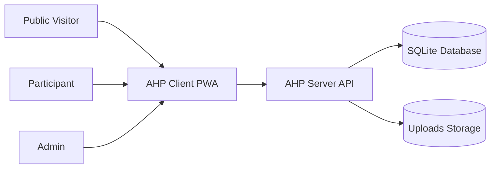
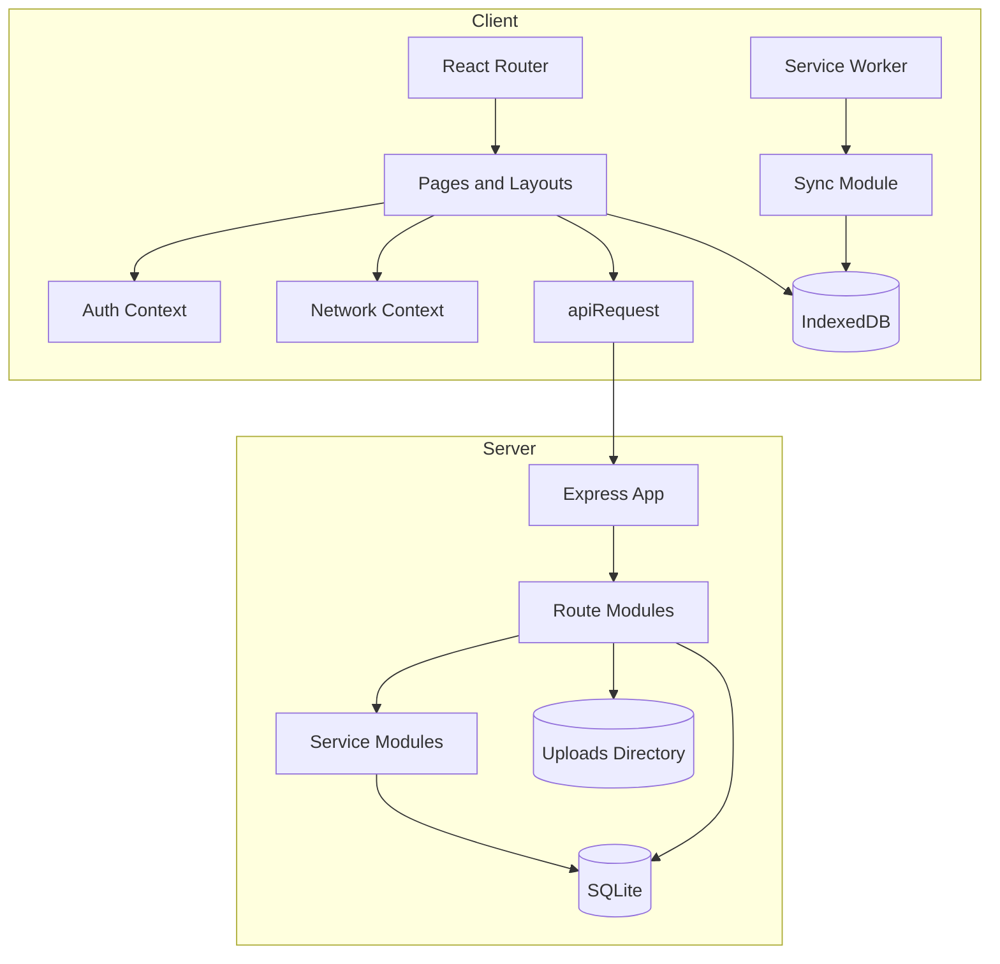
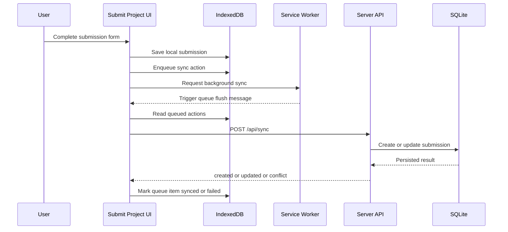
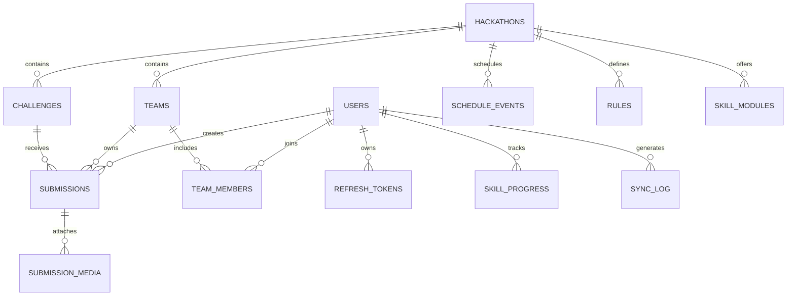

# Software Requirements Specification

## 1. Document Control

### 1.1 System Name

Aegis Hackathon Platform (AHP)

### 1.2 Document Status

Current implementation baseline

### 1.3 Last Updated

March 28, 2026

### 1.4 Document Purpose

This Software Requirements Specification (SRS) defines the current required behavior, interfaces, data model, constraints, and quality attributes of the Aegis Hackathon Platform.

This document is the authoritative requirements baseline for the repository and shall be updated whenever the implemented system behavior, interfaces, or constraints materially change.

## 2. Introduction

### 2.1 Purpose

AHP is an offline-first progressive web application for running hackathons. It supports public event discovery, participant workflows, team management, challenge submissions, admin review, and background synchronization when connectivity is intermittent.

### 2.2 Scope

The system supports:

- Public access to event information and leaderboard data
- Participant authentication and protected application access
- Viewing active hackathon content, schedules, rules, challenges, and skill tracks
- Team creation, joining, and leaving
- Challenge submission with local persistence and deferred synchronization
- Admin oversight of submissions, users, progress, and scoring

The system does not currently provide:

- A client-side binary media upload workflow in the submission UI
- A participant-facing UI for updating skill progress
- A full offline mirror of all server-backed data

### 2.3 Definitions

- PWA: Progressive Web Application
- JWT: JSON Web Token
- Sync queue: Client-side IndexedDB store that stages actions for later server synchronization
- Active hackathon: The single hackathon record marked as active in the database
- Participant: Authenticated non-admin user

## 3. Overall Description

### 3.1 Product Perspective

AHP is a two-workspace monorepo composed of:

- a React 19 + Vite client PWA
- an Express 5 + SQLite server API

The client is optimized for intermittent connectivity through service-worker caching and local IndexedDB persistence. The server is responsible for authentication, authoritative data storage, conflict handling, and admin operations.

### 3.2 User Classes

- Public visitor
  - Views landing and leaderboard pages
  - Accesses login and registration
- Participant
  - Accesses protected application routes
  - Views hackathon content and personal statistics
  - Creates or joins a team
  - Creates submissions that are queued locally and synced to the server
- Admin
  - Has all participant capabilities
  - Reviews and scores submissions
  - Views user and platform-wide reporting

### 3.3 Operating Environment

- Client
  - Modern browser with IndexedDB and service-worker support
  - React 19, Vite 7, React Router 7
- Server
  - Node.js runtime
  - Express 5
  - SQLite via `better-sqlite3`

### 3.4 Design Constraints

- The system shall remain compatible with the monorepo workspace structure
- The client shall use IndexedDB for local persistence
- The server shall use SQLite as the primary datastore
- Protected server APIs shall use JWT-based authentication
- The client shall support degraded operation during network loss

### 3.5 Assumptions And Dependencies

- Exactly one hackathon is expected to be active at a time
- Background Sync support may be unavailable in some browsers, so direct queue flushing is required as a fallback
- Client routes rely on browser-based routing with the app shell cached for offline navigation fallback

## 4. System Diagrams

### 4.1 System Context Diagram

### 4.2 Container Diagram

### 4.3 Submission Sync Sequence

### 4.4 Core Data Model Diagram

## 5. External Interface Requirements

### 5.1 Client Route Interface

The client shall expose the following routes:

- `/`
- `/login`
- `/leaderboard`
- `/app`
- `/app/challenges`
- `/app/challenges/:slug`
- `/app/leaderboard`
- `/app/teams`
- `/app/rules`
- `/app/tracks`
- `/app/submit`
- `/app/submissions`
- `/app/submissions/:id`
- `/app/admin/dashboard`
- `/app/admin/submissions`
- `/app/admin/submissions/:id`
- `/app/admin/progress`

### 5.2 API Interface

The server shall expose the following API surface:

- `GET /api/health`
- `POST /api/auth/register`
- `POST /api/auth/login`
- `POST /api/auth/refresh`
- `POST /api/auth/logout`
- `POST /api/sync`
- `GET /api/sync/status`
- `POST /api/sync/media`
- `GET /api/submissions/categories`
- `GET /api/submissions`
- `GET /api/submissions/:id`
- `GET /api/admin/submissions`
- `GET /api/admin/submissions/:id`
- `GET /api/admin/users`
- `GET /api/admin/stats`
- `PATCH /api/admin/submissions/:id/score`
- `GET /api/hackathons/active`
- `GET /api/challenges`
- `GET /api/challenges/:idOrSlug`
- `GET /api/schedule`
- `GET /api/rules`
- `GET /api/skill-modules`
- `GET /api/leaderboard`
- `GET /api/teams`
- `POST /api/teams`
- `POST /api/teams/:id/join`
- `POST /api/teams/:id/leave`
- `GET /api/me/stats`

### 5.3 Authentication Interface

- The client shall send JWT access tokens in the `Authorization: Bearer <token>` header for protected requests
- The client shall use refresh-token rotation through `POST /api/auth/refresh`
- The server shall reject unauthorized protected requests with HTTP `401`
- The server shall reject forbidden admin-only requests with HTTP `403`

### 5.4 Upload Interface

- The sync media endpoint shall accept multipart form data
- The multipart payload shall include a file field named `chunk`
- The request shall provide `X-Chunk-Index` and `X-Total-Chunks`
- The optional `uploadId` shall contain only alphanumeric, underscore, and hyphen characters

## 6. Functional Requirements

### 6.1 Public Access Requirements

- FR-1: The system shall provide a public landing page at `/`
- FR-2: The system shall provide a public leaderboard at `/leaderboard`
- FR-3: The system shall provide authentication entry through `/login`

### 6.2 Authentication Requirements

- FR-4: The system shall allow user registration with `name`, `email`, and `password`
- FR-5: The system shall reject registration requests missing required fields
- FR-6: The system shall reject invalid email formats
- FR-7: The system shall reject passwords shorter than 6 characters
- FR-8: The system shall reject duplicate email addresses
- FR-9: The system shall allow login with valid email and password credentials
- FR-10: The system shall issue access and refresh tokens after successful registration and login
- FR-11: The system shall support refresh-token rotation
- FR-12: The client shall attempt session restoration on startup when a refresh token exists
- FR-13: The client shall restrict protected application routes to authenticated users
- FR-14: The client shall restrict admin routes to users with the `admin` role

### 6.3 Hackathon Content Requirements

- FR-15: The system shall expose the active hackathon record
- FR-16: The system shall expose the challenge list for the active hackathon
- FR-17: The system shall expose challenge detail by id or slug
- FR-18: The system shall expose schedule events for the active hackathon
- FR-19: The system shall expose rules for the active hackathon
- FR-20: The system shall expose skill modules for authenticated users

### 6.4 Participant Dashboard Requirements

- FR-21: The system shall provide an authenticated dashboard at `/app`
- FR-22: The dashboard shall display submission count
- FR-23: The dashboard shall display total reviewed score
- FR-24: The dashboard shall display team rank when the user belongs to a ranked team
- FR-25: The dashboard shall display the participant team name when present
- FR-26: The dashboard shall display completed and total skill module counts

### 6.5 Team Management Requirements

- FR-27: The system shall allow participants to view teams in the active hackathon
- FR-28: The system shall allow a participant to view the participant's current team and members
- FR-29: The system shall allow a participant not already on a team to create a team
- FR-30: Team names shall have a minimum length of 2 characters
- FR-31: Team names shall have a maximum length of 50 characters
- FR-32: The system shall reject creation of a duplicate team name within the active hackathon
- FR-33: The system shall prevent a participant from joining or creating more than one team in the active hackathon
- FR-34: The system shall allow a participant to join an existing team
- FR-35: The system shall allow a participant to leave the participant's team
- FR-36: The system shall delete a team when its last member leaves

### 6.6 Submission Requirements

- FR-37: The system shall provide a multi-step submission form
- FR-38: The submission flow shall require a selected challenge before final submission
- FR-39: The submission flow shall require a project title before final submission
- FR-40: The submission flow shall require a description before final submission
- FR-41: The submission form shall preload challenges, team information, and known submission categories when available
- FR-42: The submission form shall remain usable when preload requests fail, with reduced assistance
- FR-43: The client shall create a local submission record before remote synchronization
- FR-44: The client shall generate a unique `localId` for locally created submissions
- FR-45: The client shall enqueue a sync action for each locally created submission
- FR-46: The system shall allow participants to view their submission list
- FR-47: The system shall allow participants to view their own submission detail
- FR-48: The system shall prevent a participant from reading another participant's submission detail
- FR-49: The system shall expose the set of known submission categories

### 6.7 Synchronization Requirements

- FR-50: The client shall store queued sync actions in IndexedDB
- FR-51: The client shall retry failed sync actions with backoff
- FR-52: The client shall stop retrying a queued action after 5 failed attempts and mark it failed
- FR-53: The client shall request browser Background Sync when available
- FR-54: The client shall flush the sync queue directly when Background Sync is unavailable
- FR-55: The server shall accept synchronized submission payloads through `POST /api/sync`
- FR-56: The server shall create a submission when the user has no existing submission with the same `localId`
- FR-57: The server shall update a submission when the incoming version is equal to or greater than the stored version
- FR-58: The server shall return HTTP `409` and the server copy when the incoming version is older than the stored version
- FR-59: The server shall expose a sync-status summary for the authenticated user

### 6.8 Media Upload Requirements

- FR-60: The server shall support chunked media upload through `POST /api/sync/media`
- FR-61: The media upload endpoint shall validate `X-Chunk-Index`
- FR-62: The media upload endpoint shall validate `X-Total-Chunks`
- FR-63: The media upload endpoint shall reject a request without a `chunk` file
- FR-64: The server shall assemble the final file after the last chunk is received

### 6.9 Admin Requirements

- FR-65: The system shall expose an admin dashboard
- FR-66: The system shall expose a paginated admin submission list
- FR-67: The system shall expose admin submission detail
- FR-68: The system shall expose paginated user reporting with module progress summary
- FR-69: The system shall expose aggregate admin statistics including total submissions, total users, and review rate
- FR-70: The system shall allow an admin to score a submission
- FR-71: The system shall reject negative scores
- FR-72: The system shall reject scores above the challenge `max_points` when that maximum exists
- FR-73: Scoring a submission shall set submission status to `reviewed`

### 6.10 Leaderboard Requirements

- FR-74: The system shall expose a team leaderboard
- FR-75: Leaderboard ranking shall sort by total score descending
- FR-76: Leaderboard ranking shall break ties using submission count descending

## 7. Data Requirements

### 7.1 Server Data Entities

The system shall persist the following entities in SQLite:

- `users`
  - `id`, `name`, `email`, `password_hash`, `role`, `created_at`
- `hackathons`
  - `id`, `name`, `slug`, `description`, `start_date`, `end_date`, `is_active`, `created_at`
- `challenges`
  - `id`, `hackathon_id`, `day_number`, `title`, `slug`, `difficulty`, `summary`, `description`, `setup_instructions`, `resources`, `max_points`, `unlock_at`, `created_at`
- `teams`
  - `id`, `hackathon_id`, `name`, `created_by`, `created_at`
- `team_members`
  - `id`, `team_id`, `user_id`, `role`, `joined_at`
- `schedule_events`
  - `id`, `hackathon_id`, `day_number`, `time`, `title`, `venue`, `sort_order`
- `rules`
  - `id`, `hackathon_id`, `title`, `body`, `sort_order`
- `skill_modules`
  - `id`, `hackathon_id`, `title`, `description`, `sort_order`
- `submissions`
  - `id`, `user_id`, `local_id`, `team_id`, `team_name`, `challenge_id`, `project_title`, `description`, `category`, `status`, `score`, `version`, `created_at`, `updated_at`
- `submission_media`
  - `id`, `submission_id`, `local_id`, `file_path`, `file_type`, `chunk_status`, `created_at`
- `skill_progress`
  - `id`, `user_id`, `module_id`, `status`, `completed_at`, `version`, `updated_at`
- `sync_log`
  - `id`, `user_id`, `action`, `entity_type`, `entity_id`, `timestamp`, `status`, `error_message`
- `refresh_tokens`
  - `id`, `user_id`, `token_hash`, `expires_at`, `revoked`, `created_at`

### 7.2 Client Data Entities

The client shall persist the following stores in IndexedDB:

- `submissions`
  - local submission records keyed by auto-increment id
  - indexes by local id and status
- `skillProgress`
  - local skill progress keyed by module id
- `syncQueue`
  - queued sync actions keyed by auto-increment id
  - includes retry count and next retry time
- `mediaFiles`
  - locally staged media blobs keyed by id

### 7.3 Data Integrity Requirements

- DR-1: User email addresses shall be unique
- DR-2: Hackathon slugs shall be unique
- DR-3: A challenge day number shall be unique within a hackathon
- DR-4: Team names shall be unique within a hackathon
- DR-5: A user shall not appear twice in the same team
- DR-6: Skill progress shall be unique per user and module
- DR-7: Refresh-token hashes shall be unique

## 8. Non-Functional Requirements

### 8.1 Availability

- NFR-1: The platform shall remain partially usable during network interruptions
- NFR-2: The application shell shall remain available for offline navigation after caching
- NFR-3: Cached schedule and rules data shall remain available offline when previously fetched

### 8.2 Performance

- NFR-4: Public content endpoints for schedule, rules, and challenges should be cacheable for short durations
- NFR-5: Paginated endpoints shall limit returned item counts through shared pagination logic

### 8.3 Security

- NFR-6: Protected routes shall require authentication
- NFR-7: Admin routes shall require both authentication and admin authorization
- NFR-8: Refresh tokens shall support revocation
- NFR-9: Authentication endpoints shall be rate-limited

### 8.4 Reliability

- NFR-10: The sync queue shall preserve queued actions across browser sessions through IndexedDB
- NFR-11: Failed sync items shall retain retry metadata
- NFR-12: Version conflicts shall return the server copy instead of silently overwriting data

### 8.5 Maintainability

- NFR-13: The server shall expose `createApp()` for integration testing
- NFR-14: Server tests shall execute against isolated temporary SQLite databases
- NFR-15: This document shall be revised when implemented behavior, interfaces, or constraints materially change

## 9. Constraints And Known Limitations

- KL-1: Participant skill-progress update flows are not currently exposed in the client UI
- KL-2: The sync queue supports `skillProgress` actions, but the current server behavior ignores non-submission sync payloads
- KL-3: The server supports chunked media upload, but the current submission UI does not upload binary files
- KL-4: Client logout clears locally stored tokens immediately, while explicit backend logout for refresh-token revocation is a separate server endpoint
- KL-5: Offline support is partial and centers on cached navigation, cached content, and queued submissions rather than full local replication of all remote data
- KL-6: Automated tests exist for the server only

## 10. Verification Basis

This SRS is based on the implemented behavior present in:

- client routing and protected-route definitions
- server route registration and route handlers
- SQLite schema definitions
- IndexedDB schema and sync logic
- current participant and admin page flows

Conformance of future changes shall be checked against this document before changes are considered complete.
