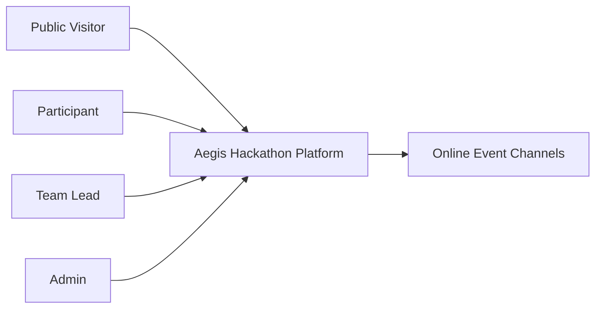
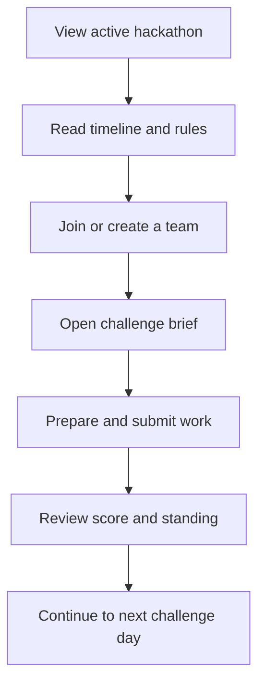
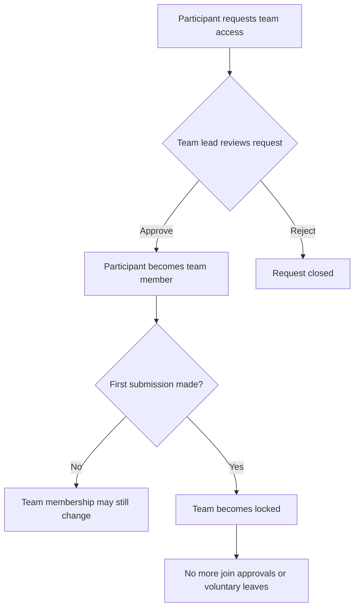
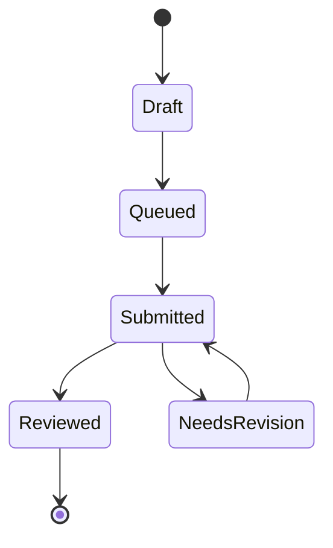

# Aegis Hackathon Platform

> An online hackathon workspace where participants join events, form teams, tackle daily challenges, submit work, and climb the leaderboard — while admins manage the full event lifecycle from a single dashboard.

Built as a progressive web app with offline support, so participants stay productive even when connectivity drops.

---

## Users

| Role | Capabilities |
|------|-------------|
| **Public visitor** | View event info, public leaderboard, sign-in page |
| **Participant** | Browse challenges, schedule, and rules; join or create teams; submit work; track progress; manage profile |
| **Team lead** | Approve or reject join requests; manage team roster before lock |
| **Admin** | Configure hackathons, manage all content, review and score submissions, monitor progress |

---

## How It Works

### Active Hackathon

The platform presents **one active hackathon** to participants at a time. Each hackathon bundles its challenges, schedule, rules, skill tracks, and policies (team size, late-submission handling) into a single event.

### Event Phases

Every hackathon moves through three phases — **upcoming**, **live**, **completed** — and the homepage always reflects the current state.

### Online-First Delivery

Schedule items reference streams, chat channels, mentor rooms, and portals. No physical venue is required.

### Teams

Participants create a team or request to join one. Team leads approve requests. Once a team records its first submission, the roster **locks** — no more joins or departures. One team per participant per hackathon.

### Challenges

Daily challenges unlock on a schedule. Each has a brief, resources, point value, and a deadline. Late submissions are accepted with the hackathon's configured penalty.

### Submissions

Participants submit a project title, description, category, and delivery links against a challenge. Admins review and assign a raw score; the platform applies any late penalty to produce the final score used on leaderboards.

### Skill Tracks

Optional learning modules participants can complete alongside challenges.

### User Profile

Participants have a profile with display name, avatar (URL-based), and bio. The avatar appears in the navbar and sidebar. Email is managed by the auth provider and displayed read-only.

### Offline Support

Previously loaded pages remain accessible during connectivity loss. Submissions queue locally and sync automatically when the connection returns.

---

## Diagrams

### Context

### Participant Flow

### Team Access Control

### Submission Lifecycle

---

## Pages

| Area | Pages |
|------|-------|
| **Public** | Landing, Login, Public Leaderboard |
| **Participant** | Dashboard, Challenges, Challenge Detail, Leaderboard, Teams, Rules, Skill Tracks, Submit, My Submissions, Submission Detail, Profile |
| **Admin** | Overview, Hackathons (full CRUD), Submissions (review/score), Progress |

Empty states show contextual guidance instead of blank content.

---

## Business Rules

- One active hackathon at a time
- Unique team names within a hackathon
- One team per participant per hackathon
- Team join requires lead approval
- Teams lock after first submission
- Challenge access follows published unlock times
- Late submissions follow the hackathon's configured penalty policy
- Admins manage all content through the UI

---

## Tech Stack

| Layer | Technology |
|-------|-----------|
| Frontend | React 19, Vite 7, Zustand, TypeScript |
| Backend | Express 5, Node 20, TypeScript |
| Database | PostgreSQL (Neon) with Drizzle ORM |
| Auth | Neon Auth (wraps better-auth), JWT with JWKS verification |
| Offline | IndexedDB via idb, sync queue, Workbox service worker |
| Styling | Vanilla CSS with design tokens |
| Monorepo | pnpm 10 workspaces (`client/`, `server/`) |

---

## Hosting & Deployment

| Service | Purpose | Tier |
|---------|---------|------|
| **Render** | App hosting (Docker) | Free |
| **Neon** | PostgreSQL database + auth | Free |

The repo includes a `render.yaml` blueprint for one-click Render deployment. Connect the GitHub repo, set the secret env vars, and deploy. The Dockerfile builds a production image serving both the API and static frontend on port 8080.

A `fly.toml` is also included as an alternative for Fly.io.

### Environment Variables

| Variable | Description |
|----------|-------------|
| `DATABASE_URL` | Neon PostgreSQL connection string |
| `NEON_AUTH_URL` | Neon Auth endpoint URL |
| `CORS_ORIGIN` | Allowed origin(s) for CORS |
| `NODE_ENV` | `production` in deployed environments |
| `PORT` | Server port (default `8080`) |

---

## Non-Functional Requirements

- **Offline resilience** — Core pages and queued submissions survive connectivity loss
- **Security** — JWT-authenticated routes; admin-only endpoints; participants cannot access others' private data
- **Usability** — Current event state, deadlines, and next actions are always visible; empty states provide guidance
- **Maintainability** — This document is updated when user-visible behavior changes

---

## Known Limitations

- Binary media upload is not yet exposed in the submission flow
- Offline support covers navigation and queued submissions, not a full local data replica
